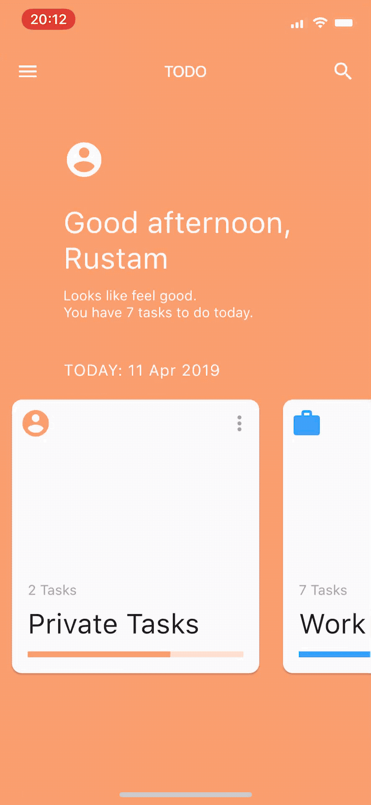
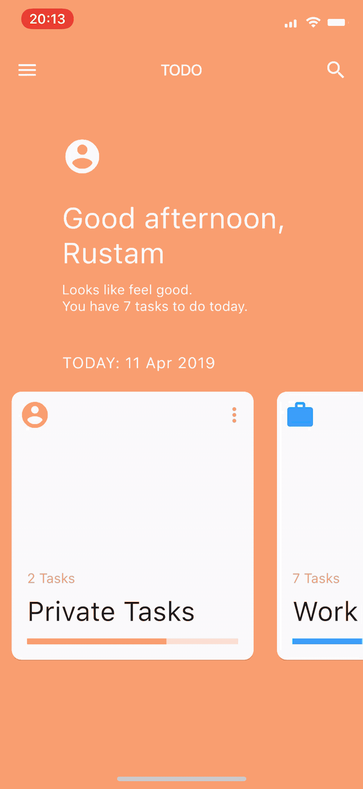
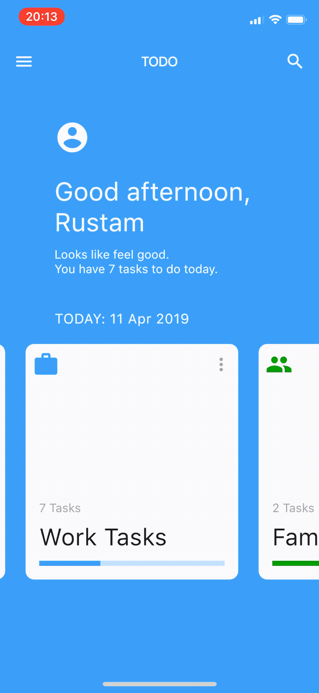

# Flutter ToDo App

ToDo application built with [Flutter](https://flutter.io) and inspired by [this Medium post](https://medium.com/@dev.n/flutter-challenge-todo-app-concept-bd36107aa291).

  

## License

This project is licensed under the terms of the MIT license. See the [LICENSE](LICENSE) file.
